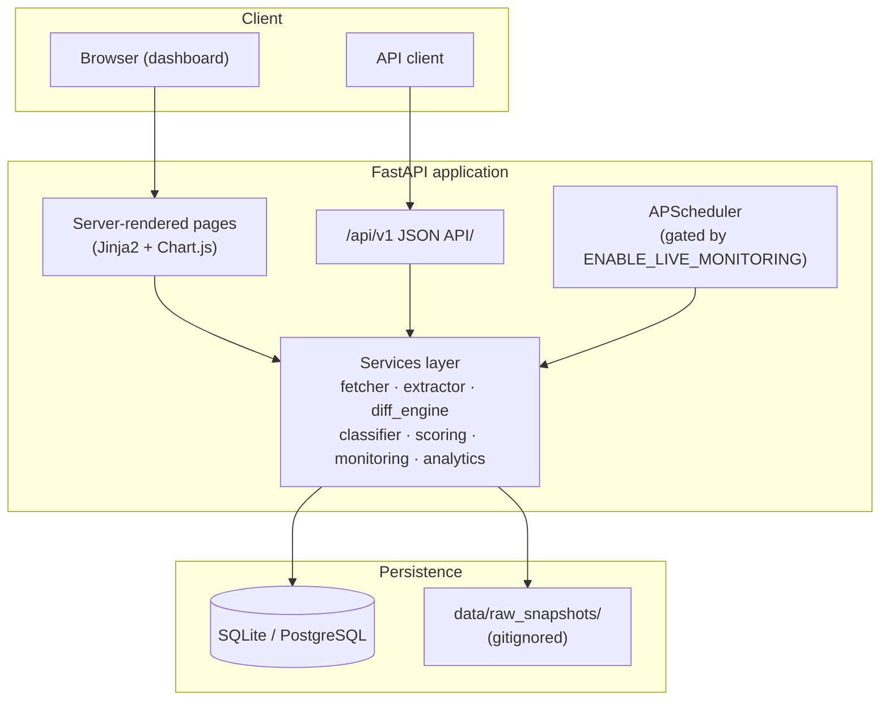
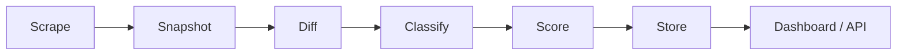

# ChangeLens Analytics

**An end-to-end data analytics platform for turning noisy website-change signals into prioritized, evidence-backed insight.**

A personal data analytics portfolio project — built to demonstrate a full pipeline: data collection → cleaning/normalization → feature engineering (diffing) → rule-based classification → a transparent scoring model → an interactive analytics dashboard with real visualizations, filtering, and drill-down.

---

## The pitch

> I wanted a project that showed the full data analyst toolkit end-to-end — ingestion, cleaning, feature engineering, classification, scoring, and visualization — on a problem that's genuinely useful: telling signal from noise in a stream of change events.

Any monitoring tool can tell you *that* something changed. The interesting analytics problem is telling you *what* changed, *how often*, *whether it's statistically/substantively meaningful*, and *what to do about it*. This project builds that layer from scratch: a monitoring pipeline that captures snapshots, a diff engine that quantifies change magnitude, a deterministic classifier that tags business-relevant categories, a transparent 0–100 scoring model, and a dashboard with multiple linked visualizations for exploring the results.

## Problem statement

Raw change alerts are noisy. A pricing-page rewrite and a footer-link reshuffle both trigger "this page changed" — but only one of them is analytically interesting. Without categorization, scoring, and aggregation, users either drown in noise or miss the signal. This project's goal: turn a stream of raw diffs into a small number of trustworthy, prioritized, explainable data points — and then actually visualize the resulting dataset the way a data analyst would explore any tabular dataset: trends over time, category breakdowns, distributions, and correlations.

## Screenshots

*(Run the app locally and add screenshots here — suggested captures: Overview dashboard, Alert Feed, Alert Detail with scoring explanation, Methodology page.)*

```
docs/screenshots/overview.png
docs/screenshots/alerts.png
docs/screenshots/alert-detail.png
docs/screenshots/methodology.png
```

## Features

- **Full data pipeline**: fetch → extract/clean → snapshot → diff (feature engineering) → classify → score → store, fully implemented and unit-tested.
- **Deterministic, explainable classification** into 11 business-relevant categories (pricing, product, hiring, leadership, funding, partnerships, PR, regulatory, customer stories, cosmetic/noise, other) — a transparent alternative to a black-box model.
- **Transparent 0–100 signal scoring** with a visible, human-readable explanation for every data point (a deliberate choice to keep the model auditable, the way a good analytics system should be).
- **Multi-chart analytics dashboard** (Chart.js): time-series trend, stacked category-over-time bars, signal-vs-noise composition, a category-share donut chart, a magnitude-vs-score scatter plot (with quadrant framing for outlier detection), and an organization leaderboard.
- **Evidence-backed drill-down**: every alert shows its raw added/removed text, category-match confidence, and full scoring breakdown — nothing is a black box.
- **Filterable, searchable alert feed** with pagination and status workflow (new / reviewed / dismissed).
- **Site management UI**: add/enable/disable tracked pages, trigger manual checks.
- **Methodology page** (Define → Acquire/Synthesize → Action Plan → Partner) summarizing the analytical framework, printable to PDF.
- **Full JSON API** under `/api/v1` with OpenAPI docs at `/docs`, so the same dataset is queryable programmatically.
- **Deterministic synthetic demo data** — the app looks alive immediately, with zero live network access required.
- **Polished UI/UX**: light/dark/ambient themes, smooth transitions, and a cursor-glow interaction layer.
- **Live monitoring safety switch**: real scraping is off by default and gated behind `ENABLE_LIVE_MONITORING=true`.

## Tech stack

Python 3.12 · FastAPI · SQLAlchemy 2.x + Alembic · SQLite (Postgres-ready via `DATABASE_URL`) · httpx + BeautifulSoup4 · Playwright (optional) · APScheduler · Jinja2 + Chart.js · pytest · Ruff + Black · Docker/docker-compose · GitHub Actions.

## Architecture



## Data flow



## Live monitoring: safety and ethics note

This is a **portfolio prototype, not a scraping tool for production use against arbitrary sites**. By default:

- `ENABLE_LIVE_MONITORING=false` — no live network requests are made anywhere in the app, tests, or seed data.
- When enabled, requests use a descriptive `User-Agent`, a conservative per-domain delay, timeouts, and limited retries with backoff.
- Only public pages are targeted; no authenticated content is ever scraped.
- `robots.txt` should be respected in any live deployment; this prototype does not implement automated `robots.txt` parsing, so any live use should be done manually and responsibly on pages you have the right to monitor.
- Demo organizations are illustrative example targets under `example-*.com` domains and fixture-generated content — no real company's live content is scraped for the demo.

## Demo data

Running `seed-demo-data` generates a **deterministic** (seeded) synthetic dataset:

- 8 organizations across Consulting, Financial Services, and Healthcare/Healthtech
- 20 tracked pages (news, careers, about, pricing)
- 130+ snapshots and 100+ classified change events across a 90-day synthetic timeline
- A realistic mix of every category, including a healthy share of cosmetic/noise events, so the signal-vs-noise chart is meaningful from the first run

All content is authored fixture copy — no live scraping is used to build the demo.

## Installation

```bash
git clone <this-repo>
cd site-tracker-analytics
cp .env.example .env
make install
make migrate
make seed
make run
```

Then visit **http://localhost:8000**.

Or, in one shot after `make install`:

```bash
make demo
```

### Docker

```bash
cp .env.example .env
docker compose up --build
```

The container runs migrations and seeds demo data automatically on first boot, then serves the app on `http://localhost:8000`.

To run against PostgreSQL instead of SQLite:

```bash
docker compose --profile postgres up --build
```
(set `DATABASE_URL` in `.env` to point at the `db` service, e.g. `postgresql+psycopg2://sitetracker:sitetracker@db:5432/sitetracker`)

## CLI commands

```bash
python -m app.cli seed-demo-data        # deterministic synthetic demo data
python -m app.cli generate-demo-events  # append an incremental batch of synthetic events
python -m app.cli run-monitor           # run the real monitoring pipeline (no-ops safely if live monitoring is off)
python -m app.cli run-monitor --page-id 1
python -m app.cli reset-demo-data       # wipe all data
alembic upgrade head                    # apply migrations
```

## API documentation

Interactive OpenAPI docs: **http://localhost:8000/docs**

Key endpoints under `/api/v1`:

- `GET /dashboard/summary`, `GET /dashboard/trends`
- `GET /alerts`, `GET /alerts/{id}`, `PATCH /alerts/{id}/status`
- `GET /sites`, `GET /sites/{id}`, `POST /sites`
- `POST /pages/{id}/monitor`, `POST /monitor/run`

## Tests and linting

```bash
make test    # pytest -- 33 tests covering extraction, diffing, classification,
             # scoring, duplicate/end-to-end pipeline, and API filtering/pagination
make lint    # ruff check . && black --check .
```

All tests run against an isolated in-memory SQLite database and fixture HTML/text — no network access required.

## Roadmap

- Automated `robots.txt` parsing and per-site crawl policy enforcement for live mode
- Configurable digest emails (daily/weekly) summarizing new high-signal alerts
- Pluggable ML-based classification alongside the current deterministic rules
- Multi-user auth and per-user saved filters/watchlists
- Vertical-specific scoring presets (e.g. healthcare regulatory weighting)

## Disclaimer

This is an independent portfolio project built to demonstrate end-to-end data analytics and data-engineering skills — ingestion, cleaning, feature engineering, classification, scoring, and visualization. All demo organizations, URLs, and content are synthetic or illustrative example targets, not live scraped data.
